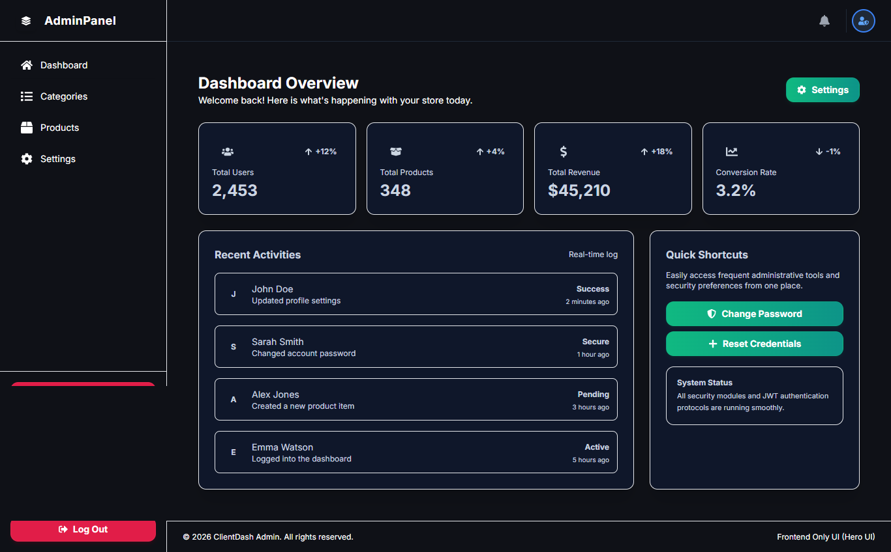
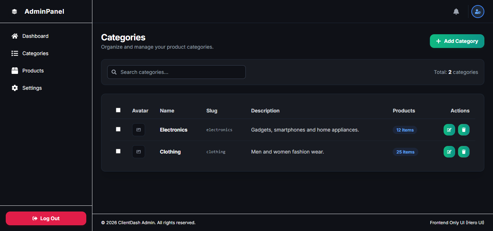
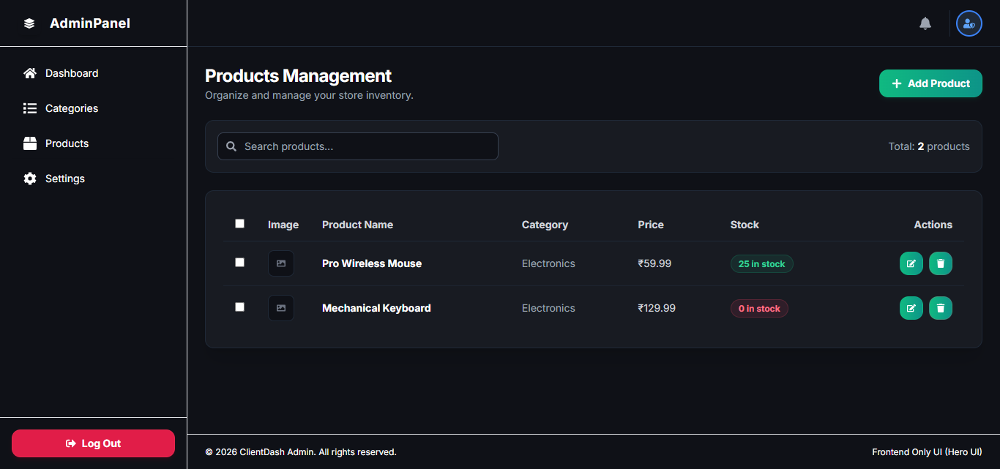
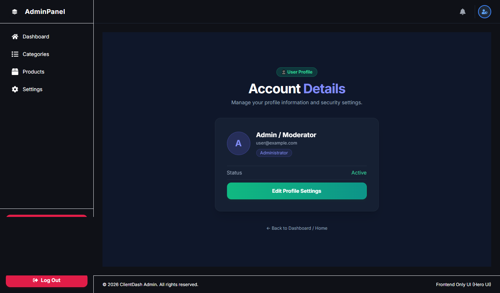
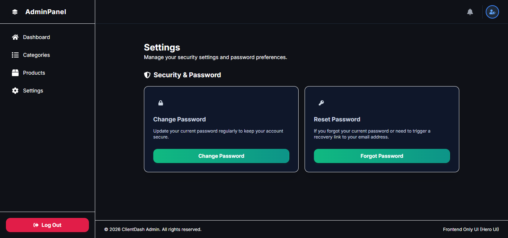

# 🚀 Professional Hero UI Admin Panel 

A modern, responsive, and feature-rich Admin Panel frontend built with **React**, **React Router**, **Tailwind CSS**, and **Hero UI/Tailwind components**, styled with a sleek dark theme.

---

## ✨ Features

- **Dashboard Overview**: Real-time KPI metric cards (Total Users, Products, Revenue, Conversion Rate) and live recent activity logs.
- **Authentication & Security Flow**: 
  - Secure Login & Registration forms.
  - Profile Management and Settings.
  - Change Password & Forgot Password workflows.
- **Catalog Management**: Dedicated sections for managing Categories and Products.
- **Robust Error Handling**: Custom styled `404 Not Found` error page.
- **Responsive Layout**: Flexbox-based alignment ensuring consistent card heights and mobile-friendly navigation.
- **Modern UI Components**: Reusable shared UI layout elements (`Button`, `Card`, `Badge`) styled consistently across all pages.

---

## 🛠️ Tech Stack

- **Framework**: React (Vite)
- **Routing**: React Router DOM
- **Styling**: Tailwind CSS
- **Icons**: React Icons
- **Design System**: Hero UI / Modern Dark Theme

---

👨‍💻 Developed by CheSubhro Built with 💜 for a seamless experience.
